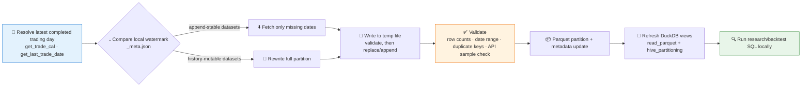

# 🗄️ Pandadata Warehouse Skill

[简体中文](README.md) | **English**

> Incrementally download Pandadata market data into a local DuckDB + Parquet warehouse: A-share / index / futures / options / HK & US daily and minute bars, adjustment factors, research factors, and trading calendars — so backtests and research query locally instead of hitting the API again and again.

**Creator / Maintainer**: [`abgyjaguo`](https://github.com/abgyjaguo)

<p align="center">
  
  
  
  
  
  
</p>

---

## 📖 What is this

`pandadata-warehouse` is an **Agent Skill** for designing and operating a local Pandadata warehouse for heavy data reuse — backtests, factor studies, and batch reports.

The design trade-offs are explicit:

- **Raw data stays close to the API contract**: source column names and types are preserved when practical; derived calculations live in downstream analysis views, never in the raw layer;
- **Parquet partitions + DuckDB views**: data lands in partitioned Parquet files; DuckDB exposes them through `read_parquet` views without copying raw data into the database (unless the user explicitly wants materialization);
- **Incremental refresh with watermarks**: keyed by the latest completed trading day, fetching only missing trading dates; full partition rewrites are reserved for history-mutable datasets (forward-adjusted prices, provider-revised factor tables);
- **Resumable failures**: failed partitions are recorded in metadata, successful partitions stay intact — nothing is silently deleted or rebuilt.

> API contracts are confirmed through the sibling skill [`pandadata-api`](https://github.com/quantskills/skill-pandadata-api) — exact `panda_data.get_*` names, parameters, fields, and date formats — before any code is written.

---

## ⚡ Incremental Refresh Pipeline



The watermark advances only after **Parquet write + metadata write + validation all succeed**.

---

## 🗂️ Nine Table Families × Source Methods × Default Partitions

| Family | Typical source methods | Default partition |
|---|---|---|
| 📅 Trading calendar | `get_trade_cal` · `get_last_trade_date` | exchange |
| 📈 A-share daily bars | `get_stock_daily` and adjusted variants | year |
| ⏱️ A-share minute bars | `get_stock_min` | symbol + month |
| 📊 Index bars | `get_index_daily` · `get_index_min` | year or month |
| 🛢️ Futures bars | `get_future_daily` · adjusted variants · `get_future_min` | year or month |
| 🎯 Options bars | `get_option_daily` | year |
| 🌏 HK/US daily bars | `get_hk_daily` · `get_us_daily` | year |
| ⚖️ Adjustment factors | `get_adj_factor` | year |
| 🧪 Research factors | `get_factor` | factor name + year |

> This table is a routing map, not an API contract — confirm method details with `pandadata-api` before coding.

### Default Layout

```text
~/.pandadata/warehouse/
  _meta.json                                      # Manifest: source method · partition keys · coverage · row counts · refresh time · status
  catalog.duckdb                                  # DuckDB view layer
  trade_cal/exchange=SH/part.parquet
  stock_daily/year=2026/part.parquet
  stock_min/symbol=000001.SZ/year=2026/month=06/part.parquet
  future_min/symbol=IF2606/year=2026/month=06/part.parquet
  factor/factor_name=<name>/year=2026/part.parquet
  ...
```

Each metadata record tracks: `table`, `source_method`, `partition_keys`, `primary_keys`, `date_column`, `start_date`/`end_date`, `last_refresh_at`, `row_count`, `schema`, `status` (`ok / partial / failed / needs_rebuild`), `notes`.

---

## 🦆 DuckDB View Pattern

Views read Parquet partitions directly — no data copies:

```sql
CREATE OR REPLACE VIEW stock_daily AS
SELECT *
FROM read_parquet('~/.pandadata/warehouse/stock_daily/**/*.parquet', hive_partitioning = true);
```

Resolve the warehouse root to an absolute path when portability matters; use `union_by_name = true` only when schema drift is expected and documented.

### Post-Refresh Validation Checklist

- ✅ Parquet files exist for every expected partition
- ✅ Required source columns are present
- ✅ Date range covers the request and does not extend past the latest completed trading day
- ✅ No duplicate primary keys within each partition
- ✅ Nonzero row counts (unless the source legitimately returns empty)
- ✅ A small sample matches fresh Pandadata API results (prefer 3 symbols × 3 dates for broad bar tables)
- ✅ DuckDB can query the refreshed view and returns the expected date range

Failed checks mark the partition `partial` / `failed`, keep the previous valid data, and come with a retry or rebuild plan.

---

## 🚀 Quick Start

### 1️⃣ Install (together with pandadata-api)

```bash
# Claude Code (global)
cp -r skill-pandadata-api       ~/.claude/skills/pandadata-api
cp -r skill-pandadata-warehouse ~/.claude/skills/pandadata-warehouse

# Codex (global, Agent Skills standard directory recommended)
mkdir -p ~/.agents/skills
cp -r skill-pandadata-api       ~/.agents/skills/pandadata-api
cp -r skill-pandadata-warehouse ~/.agents/skills/pandadata-warehouse

# Cursor (project level)
mkdir -p .cursor/skills
cp -r skill-pandadata-api       .cursor/skills/pandadata-api
cp -r skill-pandadata-warehouse .cursor/skills/pandadata-warehouse
```

### 2️⃣ Ask in natural language

```text
把沪深300成分股近5年日线缓存到本地，建一个DuckDB仓库
增量更新一下本地行情数据到最新交易日
用DuckDB查一下本地已下载的数据覆盖到哪天了
校验一下本地股票日线和API是否一致
```

### 3️⃣ Five operation types

```
initialize → refresh (incremental) → query (DuckDB SQL)
→ validate (sample check vs API) → repair (failed/duplicate partitions)
```

---

## 📦 Directory Layout

```
pandadata-warehouse/
├── SKILL.md                       # Skill entry: workflow, family routing, core rules, runtime compatibility
├── references/
│   └── warehouse-playbook.md      # 📒 Layout, metadata spec, refresh strategy, DuckDB view pattern, validation checklist, safety rules
└── agents/
    ├── openai.yaml                # OpenAI/Codex adapter
    ├── cursor-rule.mdc            # Cursor project-rule adapter
    └── portable-loader.md         # Generic loader (used by Claude Code / Hermes / OpenClaw)
```

### Cross-Agent Use

| Runtime | How |
|---|---|
| Codex | Use `SKILL.md` directly; `agents/openai.yaml` provides UI metadata |
| Cursor | Use `agents/cursor-rule.mdc` as project rule/loader |
| Claude Code / Hermes / OpenClaw | Use `agents/portable-loader.md` to point the runtime at this skill root, reading `SKILL.md` first |

---

## 📐 Core Rules

| Rule | Description |
|---|---|
| 💧 Incremental first | Refresh keyed by the latest completed trading day; full partition rewrites only for history-mutable datasets |
| 🚫 No silent destruction | Before deleting/overwriting/rebuilding partitions: list affected files, explain why, get confirmation |
| 📏 Scope before scale | No broad all-market minute downloads unless the user supplies a symbol universe or confirms the expected size |
| 🔁 Resumable failures | Failed partitions recorded; successful partitions left intact |
| 👁️ Visible freshness | Answers and generated code state source method, last local date, latest API/trading date checked, stale-data warnings |
| 🔐 Credential isolation | Credentials stay out of metadata, Parquet files, logs, and generated reports |

---

## ⚠️ Disclaimer

This skill is for local data engineering and research support. Its output does not constitute investment advice.
