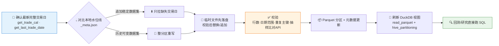

# 🗄️ Pandadata Warehouse Skill

**简体中文** | [English](README.en.md)

> 把 Pandadata 行情数据增量下载到本地 DuckDB + Parquet 仓库：A股/指数/期货/期权/港美股日线分钟线、复权因子、研究因子、交易日历 —— 回测与研究直接查本地，不再重复调 API。

**创建者 / 维护者**：[`abgyjaguo`](https://github.com/abgyjaguo)

<p align="center">
  
  
  
  
  
  
</p>

---

## 📖 这是什么

`pandadata-warehouse` 是一个 **Agent Skill**：为重度数据复用场景（回测、因子研究、批量报告）设计和运维一个本地 Pandadata 数据仓库。

设计取舍很明确：

- **原始数据贴近 API 契约**：尽量保留来源列名与类型，衍生计算放到下游分析视图，不污染原始层；
- **Parquet 分区存储 + DuckDB 视图查询**：数据落在分区 Parquet 文件里，DuckDB 通过 `read_parquet` 建视图，不把原始数据复制进数据库（除非用户明确要物化）；
- **增量刷新 + 水位线**：以最新完整交易日为水位，只补缺失的交易日；历史可变的数据集（如前复权价、会修订的因子表）才整分区重写；
- **失败可续传**：失败分区记录在元数据里，成功分区原样保留，绝不静默删除或重建。

> 接口契约一律经姊妹技能 [`pandadata-api`](https://github.com/quantskills/skill-pandadata-api) 确认 `panda_data.get_*` 的方法名、参数、字段与日期格式后再写代码。

---

## ⚡ 增量刷新流水线



水位线只在 **Parquet 写入 + 元数据写入 + 校验全部成功**后才推进。

---

## 🗂️ 九大表族 × 来源接口 × 默认分区

| 表族 | 典型来源接口 | 默认分区 |
|---|---|---|
| 📅 交易日历 | `get_trade_cal` · `get_last_trade_date` | 按交易所 |
| 📈 A股日线 | `get_stock_daily` 及复权日线变体 | 按年 |
| ⏱️ A股分钟线 | `get_stock_min` | 按代码 + 月 |
| 📊 指数K线 | `get_index_daily` · `get_index_min` | 按年或月 |
| 🛢️ 期货K线 | `get_future_daily` · 复权变体 · `get_future_min` | 按年或月 |
| 🎯 期权K线 | `get_option_daily` | 按年 |
| 🌏 港/美股日线 | `get_hk_daily` · `get_us_daily` | 按年 |
| ⚖️ 复权因子 | `get_adj_factor` | 按年 |
| 🧪 研究因子 | `get_factor` | 按因子名 + 年 |

> 此表是路由地图，不是 API 契约 —— 编码前用 `pandadata-api` 确认方法细节。

### 默认目录布局

```text
~/.pandadata/warehouse/
  _meta.json                                      # 元数据清单：来源方法·分区键·覆盖范围·行数·刷新时间·状态
  catalog.duckdb                                  # DuckDB 视图层
  trade_cal/exchange=SH/part.parquet
  stock_daily/year=2026/part.parquet
  stock_min/symbol=000001.SZ/year=2026/month=06/part.parquet
  future_min/symbol=IF2606/year=2026/month=06/part.parquet
  factor/factor_name=<name>/year=2026/part.parquet
  ...
```

每条元数据记录包含：`table`、`source_method`、`partition_keys`、`primary_keys`、`date_column`、`start_date`/`end_date`、`last_refresh_at`、`row_count`、`schema`、`status`（`ok / partial / failed / needs_rebuild`）、`notes`。

---

## 🦆 DuckDB 视图模式

视图直接读 Parquet 分区，不复制数据：

```sql
CREATE OR REPLACE VIEW stock_daily AS
SELECT *
FROM read_parquet('~/.pandadata/warehouse/stock_daily/**/*.parquet', hive_partitioning = true);
```

需要可移植性时把仓库根目录解析为绝对路径；仅在预期且已记录 schema 漂移时用 `union_by_name = true`。

### 每次刷新后的校验清单

- ✅ 每个预期分区都有 Parquet 文件
- ✅ 必需的来源列齐全
- ✅ 日期范围覆盖请求区间，且不超过最新完整交易日
- ✅ 分区内无重复主键
- ✅ 行数非零（除非来源本来就为空）
- ✅ 小样本与 Pandadata 实时 API 比对一致（宽表建议 3 个代码 × 3 个日期）
- ✅ DuckDB 视图可查询且返回预期日期范围

校验失败的分区标记 `partial` / `failed`，保留上一份有效数据，并说明重试或重建计划。

---

## 🚀 快速开始

### 1️⃣ 安装（与 pandadata-api 一起）

```bash
# Claude Code（全局）
cp -r skill-pandadata-api       ~/.claude/skills/pandadata-api
cp -r skill-pandadata-warehouse ~/.claude/skills/pandadata-warehouse

# Codex（全局，推荐 Agent Skills 标准目录）
mkdir -p ~/.agents/skills
cp -r skill-pandadata-api       ~/.agents/skills/pandadata-api
cp -r skill-pandadata-warehouse ~/.agents/skills/pandadata-warehouse

# Cursor（项目级）
mkdir -p .cursor/skills
cp -r skill-pandadata-api       .cursor/skills/pandadata-api
cp -r skill-pandadata-warehouse .cursor/skills/pandadata-warehouse
```

### 2️⃣ 直接用自然语言提问

```text
把沪深300成分股近5年日线缓存到本地，建一个DuckDB仓库
增量更新一下本地行情数据到最新交易日
用DuckDB查一下本地已下载的数据覆盖到哪天了
校验一下本地股票日线和API是否一致
```

### 3️⃣ 五种操作类型

```
initialize（建仓） → refresh（增量刷新） → query（DuckDB SQL查询）
→ validate（与API抽样比对） → repair（修复失败/重复分区）
```

---

## 📦 目录结构

```
pandadata-warehouse/
├── SKILL.md                       # 技能入口：工作流、表族路由、核心规则、运行时兼容
├── references/
│   └── warehouse-playbook.md      # 📒 目录布局、元数据规范、刷新策略、DuckDB视图模式、校验清单、安全规则
└── agents/
    ├── openai.yaml                # OpenAI/Codex 适配
    ├── cursor-rule.mdc            # Cursor 项目规则适配
    └── portable-loader.md         # 通用加载器（Claude Code / Hermes / OpenClaw 可用）
```

### 跨 Agent 使用

| 运行时 | 方式 |
|---|---|
| Codex | 直接使用 `SKILL.md`，`agents/openai.yaml` 提供 UI 元数据 |
| Cursor | `agents/cursor-rule.mdc` 作项目规则/加载器 |
| Claude Code / Hermes / OpenClaw | 用 `agents/portable-loader.md` 指向本技能根目录，先读 `SKILL.md` |

---

## 📐 核心规则

| 规则 | 说明 |
|---|---|
| 💧 增量优先 | 以最新完整交易日为水位线增量刷新；只有历史可变数据集才整分区重写 |
| 🚫 不静默破坏 | 删除/覆盖/重建分区前先列出受影响文件并说明原因，未授权不动手 |
| 📏 范围先确认 | 不跑全市场分钟线大下载，除非用户明确给出代码池或确认预期数据量 |
| 🔁 失败可续传 | 失败分区记录在案，成功分区保持完整 |
| 👁️ 新鲜度可见 | 回答与生成代码中标注来源方法、本地最新日期、API/交易日最新日期与过期警告 |
| 🔐 凭证隔离 | 凭证不进元数据、Parquet、日志和生成的报告 |

---

## ⚠️ 免责声明

本技能用于本地数据工程与研究支持，输出不构成任何投资建议。
